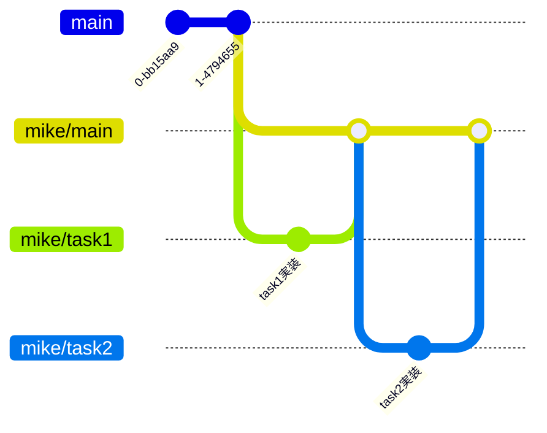

# Android Developer Journey

このプロジェクトは、Android開発の経験が浅い初学者（主に学生インターン）を対象に、実務レベルの開発スキルを段階的に習得できるよう設計されています。
実際に動作するグループウェアアプリ「Kintone Spaces」をベースに、実践的なタスクを通じて学習を進めます。

## 対象者と前提スキル

### 対象者
- Android開発の経験が浅い初学者
- 学生インターン
- 実務レベルの開発を学びたい方

### 前提スキル
- Androidのネイティブアプリ開発経験
   - コピー&ペーストではなく、自分でコードを書いてアプリを作ったことがある (実装した内容の規模は問わない）
   - 基本的なUIやHTTP通信処理を実装した経験がある
- Kotlinでの開発経験
- Gitの基本的な操作

## このプロジェクトで学べること

### 技術スキル
- **Android開発の基礎**
   - Activity、ViewModelの概念
   - Jetpack ComposeによるUI構築
   - Android Studioの使い方

- **実践的なアプリ設計**
   - マルチモジュールによる関心の分離
   - UI = 状態 + レイアウト という現代的なGUI開発の考え方

- **ユニットテストの書き方**
   - JUnitを使ったユニットテストの方法
   - テストダブルの使い方

- **業務で使われる開発フロー**
   - コードレビューを意識した開発
   - CIによる継続的なコードチェック

### ソフトスキル
- 問題を小さく分割して解決する力
- 既存コードを読んで理解する力
- エラーメッセージから原因を特定する力
- ドキュメントを調べて自己解決する力

## 準備

### ブランチの準備
このプロジェクトで学習を進める際は、mainブランチに成果物をマージしないでください。
代わりに、`GitHubアカウント名/`で始まる個人用のブランチを作成し、そこに実装していきます。

例えば`mike`というアカウント名だった場合、
- `mike/main`ブランチ
   - 最新の`main`ブランチから作成
   - タスクの成果をマージしていく用のブランチ
- `mike/taskX`ブランチ
   - タスクごとの実装ブランチ
   - タスク番号に応じて`mike/task1`, `mike/task2`のように命名
   - 最新の`mike/main`ブランチから作成

ブランチの全体像は以下のような形になります。



### 接続する環境の設定
このプロジェクトでは、KintoneのAPIを利用してデータを取得します。
そのため、Kintoneの開発環境を用意する必要があります。
開発環境の情報はメンターに確認してください。

接続する開発環境の情報は、以下のように`local.properties`ファイルに設定します。

```properties
user=taro
password=taro_password
domain=example.cybozu-dev.com
```

`local.properties`ファイルはプロジェクトのルートディレクトリに作成してください。

```
android-developer-journey/
  ├ .github/
  ├ app/
  ├ build-logic/
  ├ core/
  ...
  ├ local.properties
```

## タスクの進め方

### 1. タスクの確認
具体的なタスクは [taskディレクトリ](../task) に用意しています。
タスクはファイルの番号順に進めてください。
各タスクファイルには以下が記載されています。

- タスク内容：何を実装するか
- 学び：そのタスクで習得できるスキル
- ヒント：実装のためのヒント
- 参考情報：関連するドキュメントやリソース

### 2. 実装
- 既存のコードスタイルに合わせて実装
- タスクでテストが要求されている場合は必ず書く
- 既存のテストが通ることを確認

### 3. セルフチェック
実装が完了したら、以下を確認：
- [ ] 要件を満たしているか
- [ ] 既存のテストが壊れていないか
- [ ] コードは読みやすいか
- [ ] 不要なコメントやデバッグコードが残っていないか
- [ ] Lintが通過するか

### 4. コードレビュー
- 自分のmainブランチに向けてPull Requestを作成
- メンターのコードレビューを受ける
- 指摘された点を修正
- Approveされたら自分のmainブランチにマージする

## お題アプリ「Kintone Spaces」
- [Kintone Spaces アプリ概要](docs/app_overview.md)にアプリの仕様と機能を記載しています
- [Kintone Spaces コード概要](docs/code_overview.md)にアプリの技術解説を記載しています
