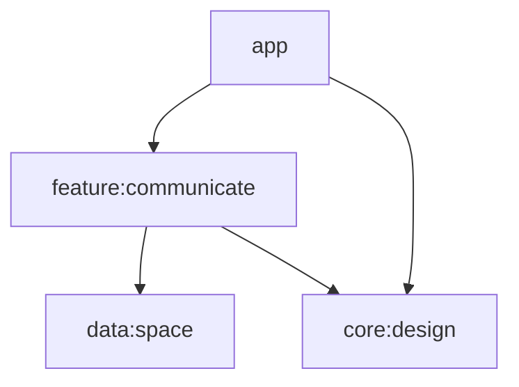

# Kintone Spacesアプリのコード概要

## アーキテクチャ

[Android Developersのアーキテクチャガイド](https://developer.android.com/topic/architecture)に倣って実装しています。
このガイドでは2層構造のアーキテクチャが解説されています。

### UI層

[UI layer \| App architecture \| Android Developers](https://developer.android.com/topic/architecture/ui-layer)

アプリのUIを構築する層。
UIは`UI = 状態 + レイアウト`という考え方で構成します。

- 状態
  - 画面に表示するデータ
  - data classで定義されるデータ構造として表現する
- レイアウト
  - 状態に基づいて画面をレンダリングしてUIを構築するコード
  - Jetpack ComposeのComposable関数で表現する

### データ層

[Data layer \| App architecture \| Android Developers](https://developer.android.com/topic/architecture/data-layer)

アプリを駆動させるためのデータを準備する層。
バックエンドサーバやローカルのデータベース、メモリ内などに保存しているデータをUI層に提供します。

### モジュール構成

Kintone Spacesアプリは、マルチモジュールのアーキテクチャを採用しています。これにより、各コンポーネントの責務を分離しています。

| モジュール    | 役割                             | 代表的なコード                 |
|----------|--------------------------------|-------------------------|
| :app     | アプリケーション全体を管理するモジュール。          | Activity, Navigationの設定 |
| :feature | アプリのUI機能を提供するモジュール。いわゆるUI層。    | UI実装, 画面単位のViewModel    |
| :data    | アプリが利用するデータを提供するモジュール。いわゆるデータ層 | Repository, data class  |
| :core    | モジュール間で共有したいコードを配置するモジュール。     | Theme                   |

:feature, :data, :core以下にはさらに用途に応じてサブモジュールを配置できます。
例えば、`:feature:communicate`はコミュニケーション用の機能を集約した:featureモジュールです。
機能が拡大してくれば、`:feature:search`のように別のサブモジュールを追加することもできます。

具体的なモジュール依存関係:



### 使用技術

- [Jetpack Compose](https://developer.android.com/jetpack/compose)
  - 宣言的UIの考え方を採用し、状態に基づいてUIを構築
- [AndroidX Libraries](https://developer.android.com/jetpack/androidx)
  - Androidアプリを構築する基本機能を使用（ViewModel, Navigation)
- [Kotlin Coroutines](https://kotlinlang.org/docs/coroutines-overview.html)
  - ネットワーク通信など非同期で処理したい場合に使用
- [OkHttp](https://square.github.io/okhttp/), [Retrofit](https://square.github.io/retrofit/)
  - HTTP通信を行うためのライブラリ
- [Dagger Hilt](https://dagger.dev/hilt/)
  - 依存性注入を簡素化するためのライブラリ

## Linter

[ktlint](https://github.com/pinterest/ktlint)を使用して、Kotlinコードのスタイルを統一しています。

ktlintの実行方法:

```bash
# フォーマットチェック
./gradlew ktlintCheck

# 自動フォーマット
./gradlew ktlintFormat
```

## テスト

各モジュールの`src/test`以下にテストコードを実装しています。
[Build local unit tests \| Test your app on Android \| Android Developers](https://developer.android.com/training/testing/local-tests)で解説されている内容をベースに、追加のテストライブラリを使用してテストの可読性を高めています。

- アサーション
  - [Kotest Assertions](https://kotest.io/docs/assertions/assertions.html)を使用
  - `name shouldBe "sam"`のような英文法に近い記述が可能
- kotlinx.coroutines.Flowのテスト
  - [turbine](https://github.com/cashapp/turbine)を使用
  - Flowに流れてくる値をテストするための `Flow.test {}` 拡張関数を利用可能になる

テストの実行方法:

```bash
# すべてのユニットテストを実行
./gradlew testDebugUnitTest

# 特定モジュールのテスト
./gradlew :feature:communicate:testDebugUnitTest
```

## CI

[GitHub Actions](https://docs.github.com/ja/actions)を使用して、コードの品質を保つためのCIを設定しています。
以下の2つのjobが定義されています。

CIの実行結果は Pull Requestや[Actionsタブ](https://github.com/cybozu/android-developer-journey/actions)で確認できます。

| job  | 処理                    | 実行タイミング             |
|------|-----------------------|---------------------|
| test | ユニットテストの実行            | Pull Requestの作成/変更時 |
| lint | コードスタイルのチェックと自動フォーマット | Pull Requestの作成/変更時 |
